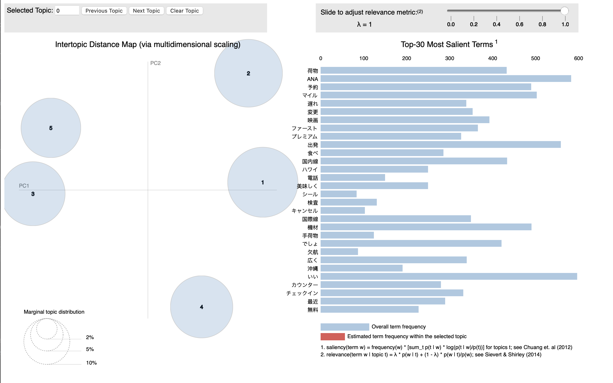

# Get started
Python version: `3.12.4`
```bash
pip install -r requirements.txt
python3 main.py
```

# Topics modelling example
Topic modelling based for japanese dataset. [Japanese dataset link](https://www.kaggle.com/datasets/kanchana1990/japanese-airlines-reviews)


